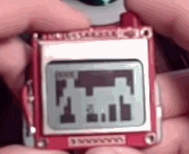

[Video of the project.](https://vimeo.com/110753789)

This is a helicopter game written in AVR assembly for an ATTiny13A connected to a Nokia 3310 LCD and 1 button. Made for the fun of the challenge to fit a graphical game into 1 KB code space and 64 bytes of RAM while running at 1 MHz.

High scores are saved in EEPROM so you can compete to be the best.

The level gen program is a Processing sketch that outputs a source file representing a level for the game.

Some of the code might be useful to look at:

* `lib_lcd` - Shows the magic numbers needed to make the cheap 3310 LCD work. Implements software SPI.
* `lib_disphex` - Very simple printing of hexadecimal numbers in assembly code.
* `lib_eeprom` - Basic use of EEPROM.

